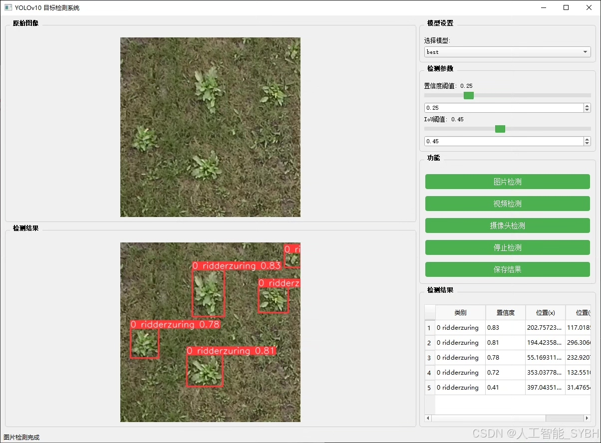
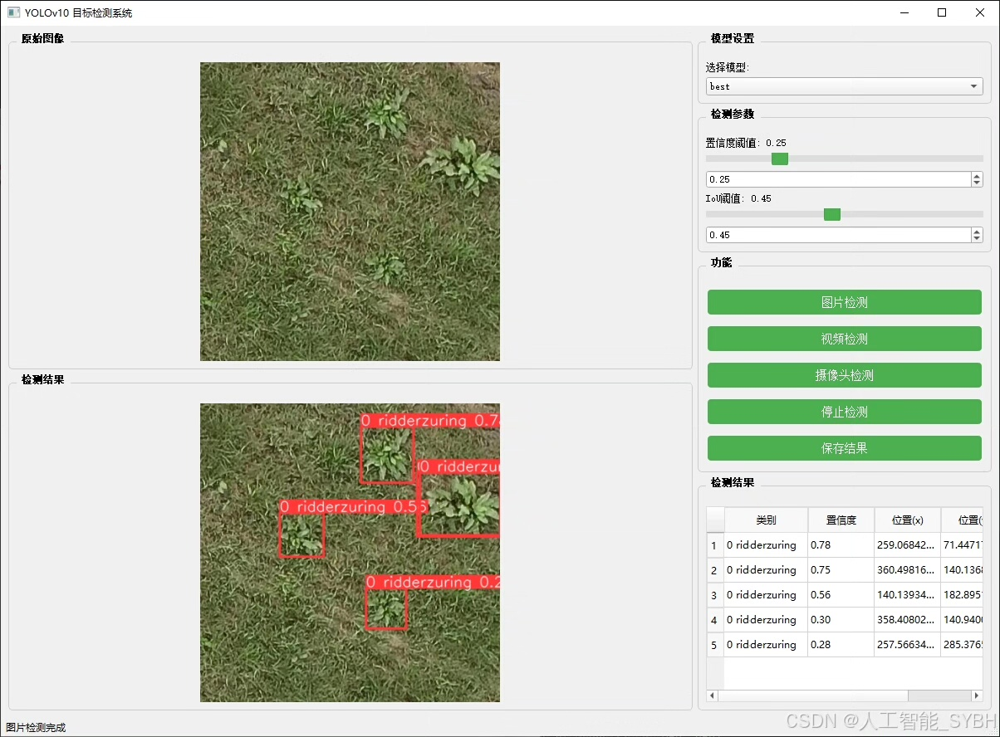
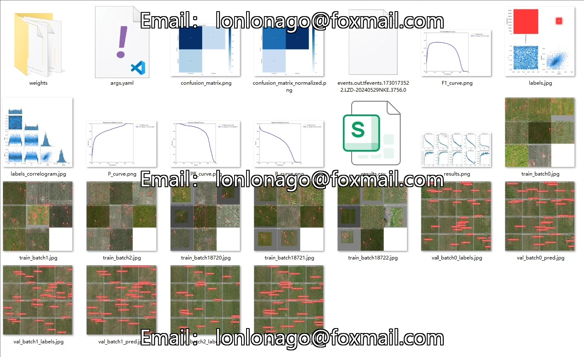
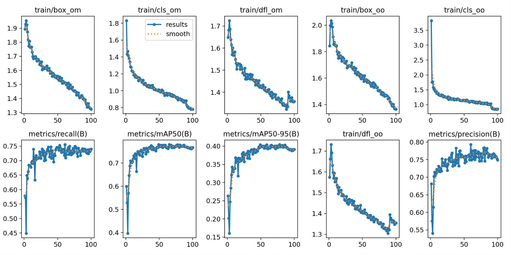
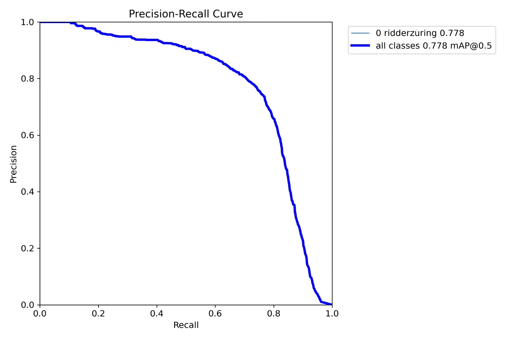
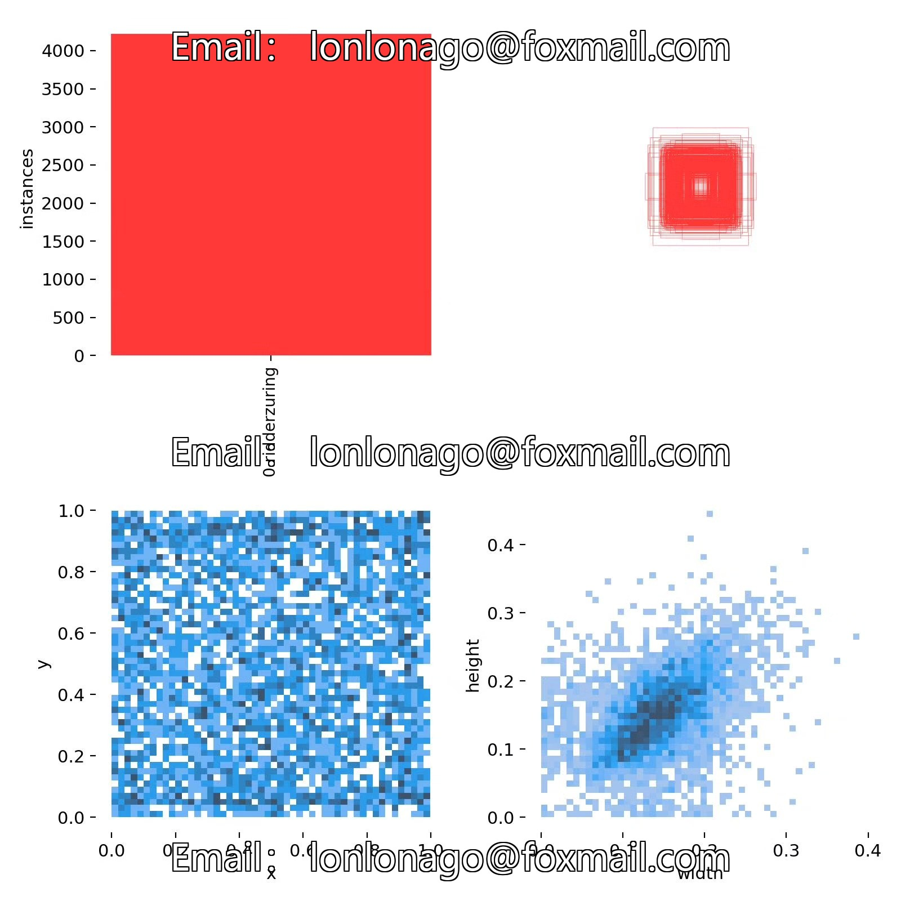
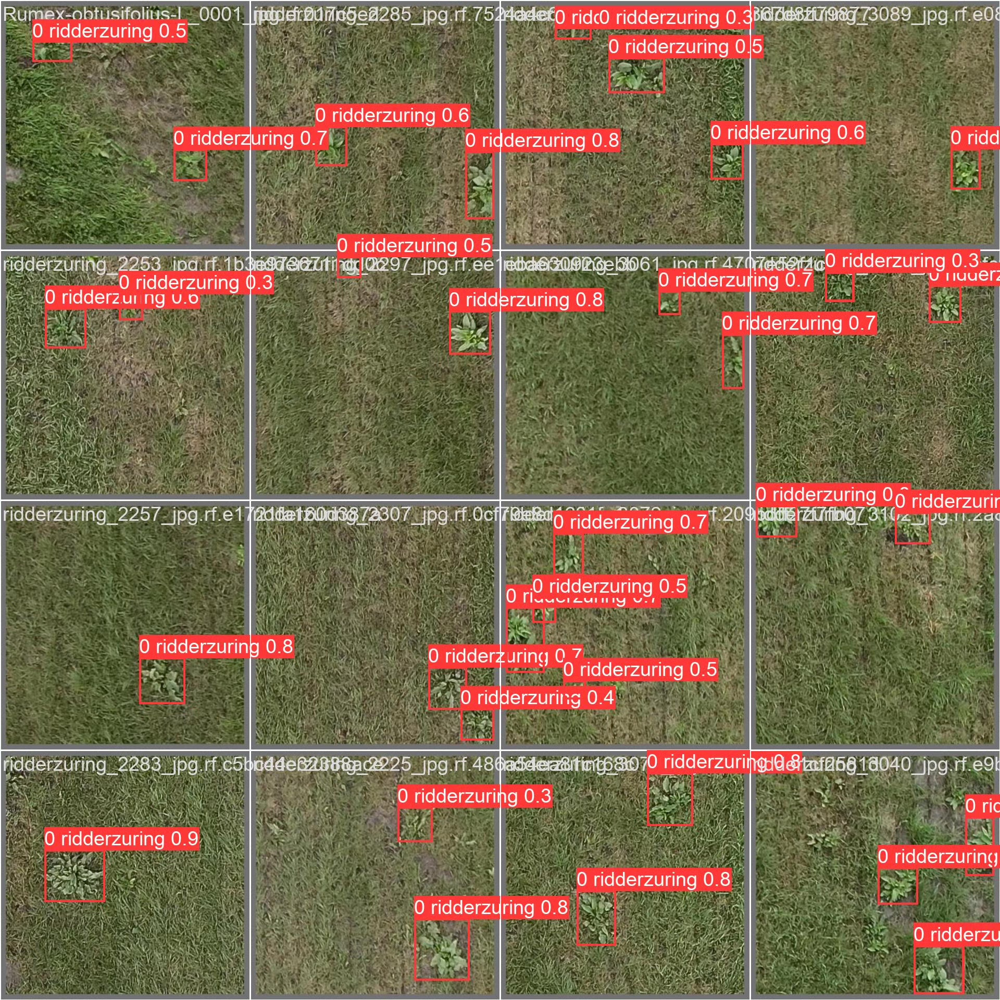

# Based on YOLOv10 deep learning for weed detection system (YOLOv10+Y)

## Body

This project utilizes the YOLO (You Only Look Once) object detection algorithm to automatically identify specific weeds in farmland, aiming to assist agricultural automation management by recognizing and localizing "0 ridderzuring" weeds through computer vision technology. The timely identification and handling of weeds are crucial for enhancing agricultural production efficiency and protecting crop growth environments. YOLOv10, as an efficient target detection algorithm, can detect different types of targets with high accuracy and speed, making it widely applied in the field of agriculture.

Dataset size:
Training set: 1661 images
Validation set: 580 images
Test set: 245 images

The company's products have obtained the official commercial license certification from YOLO.

Package after-sales service:
After payment, a WeChat account will be provided, which can answer questions anytime.

Environment configuration: A tutorial on environment configuration will be provided, and WeChat will provide answers.
Remote installation service: If remote configuration is needed, an additional fee of 69 is required, with all fees refunded if the configuration fails (only refund installation fees for older computers).

Retraining dataset: After setting up the environment, you can train on your own computer. If you need us to retrain, just pay 69 plus computing power fees (2.5 yuan/hour).

Full after-sales service

## Images

## Payment

Here is a pay link on Stripe ( https://buy.stripe.com/3cs8yP7sY87d0vu9AB ). Please contact me lonlonago@foxmail.com after funding $89, and I will send you a complete data files , thank you!

